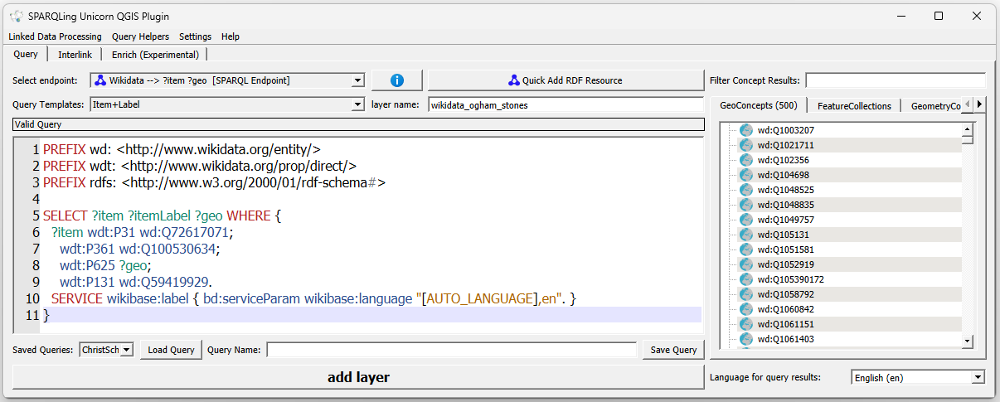
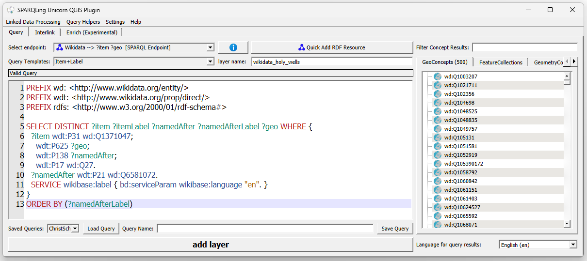
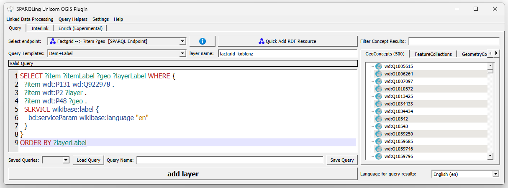
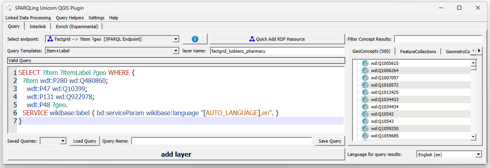
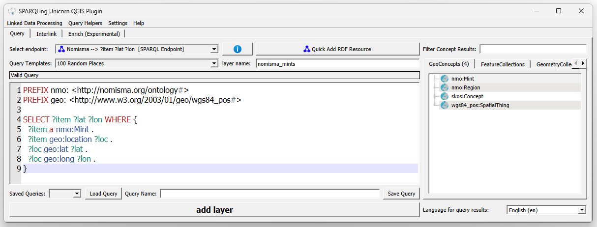
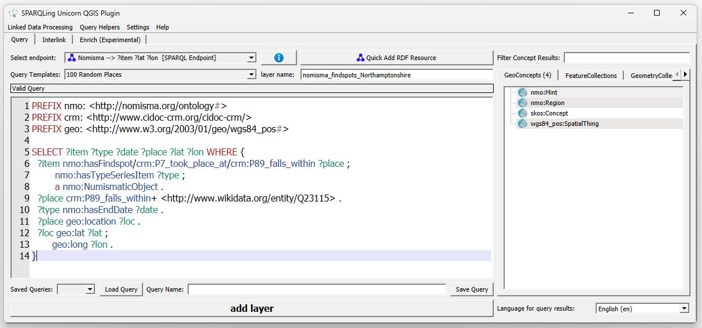
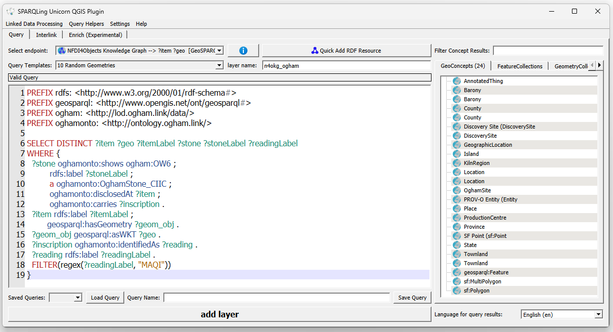
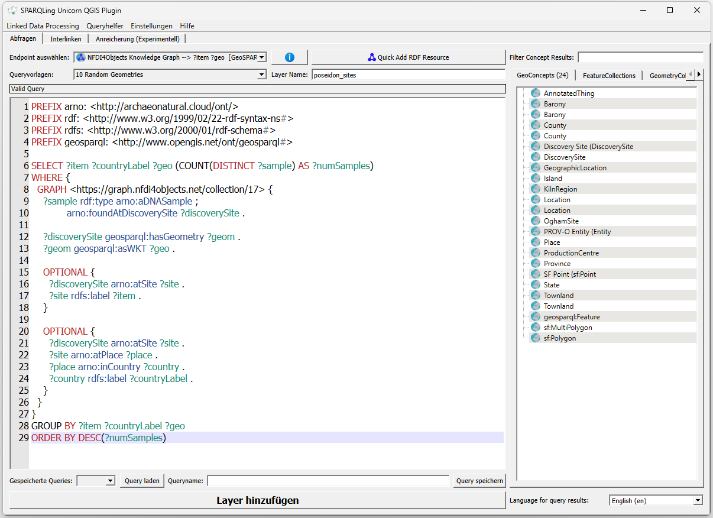

# Install the SPARQLing Unicorn QGIS Plugin


# Queries

This page collects example SPARQL queries for the SPARQLing Unicorn
QGIS Plugin across four endpoints of increasing specificity:

1. **Wikidata** — general-purpose, community-curated knowledge graph.
2. **FactGrid** — Wikibase instance for historical research, ideal to
   transfer Wikidata skills to a domain context.
3. **Nomisma.org** — domain-specific vocabulary and data hub for
   numismatics, built on a custom ontology (`nmo:`).
4. **NFDI4Objects Knowledge Graph** — research infrastructure for
   object-related data in archaeology, accessed per named graph
   (`collection/*`).

Each query can be pasted directly into the plugin's query editor
(`Linked Data Processing → Concept Query`) and executed against the
endpoint given at the top of each section. Where the plugin is
GeoSPARQL-aware, the `?geo`, `?wkt`, or `?lat`/`?lon` variables are
auto-detected and the results are rendered as a QGIS vector layer.

## Wikidata — Ogham stones on the Dingle peninsula

**Endpoint:** `https://query.wikidata.org/sparql`

A worked example from the Linked Open Ogham project (Schmidt & Thiery
2022): all CIIC-catalogued Ogham stones (`wd:Q72617071`) that are
*part of* the Corpus Inscriptionum Insularum Celticarum
(`wdt:P361 wd:Q100530634`) and administratively located on the
Dingle peninsula (`wdt:P131 wd:Q59419929`). The `SERVICE wikibase:label`
block adds a localised `?itemLabel` automatically — a Wikibase-specific
convenience that saves an explicit `rdfs:label` triple with a language
filter.



```sparql
SELECT ?item ?itemLabel ?geo WHERE {
  ?item wdt:P31 wd:Q72617071;
    wdt:P361 wd:Q100530634;
    wdt:P625 ?geo;
    wdt:P131 wd:Q59419929.
  SERVICE wikibase:label { bd:serviceParam wikibase:language "[AUTO_LANGUAGE],en". }
}
```

## Wikidata — Holy Wells in Ireland

**Endpoint:** `https://query.wikidata.org/sparql`

The second Wikidata example queries Holy Wells curated by the Research
Squirrel Engineers' *WikiProject HolyWells*. It returns every item
typed as *Holy Well* (`wd:Q1371047`) located in Ireland (`wd:Q27`) and
named after a female saint (`wdt:P21 wd:Q6581072`) — swap in
`wd:Q6581097` to flip to male saints. The result is ordered by
`?namedAfterLabel`, which groups stones by their patron saint in the
QGIS attribute table.



```sparql
SELECT DISTINCT ?item ?itemLabel ?namedAfter ?namedAfterLabel ?geo WHERE {
  ?item wdt:P31 wd:Q1371047;
    wdt:P625 ?geo;
    wdt:P138 ?namedAfter;
    wdt:P17 wd:Q27.
  ?namedAfter wdt:P21 wd:Q6581072.
  SERVICE wikibase:label { bd:serviceParam wikibase:language "en". }
}
ORDER BY (?namedAfterLabel)
```

## FactGrid — historical sites in Koblenz

**Endpoint:** `https://database.factgrid.de/sparql`

FactGrid is a Wikibase instance, so properties are `P…` but with their
own IDs distinct from Wikidata. This query is taken from the FactGrid
[*Mapping Koblenz*](https://database.factgrid.de/wiki/FactGrid:Mapping_Koblenz)
project and returns every FactGrid item administratively located in
Koblenz (`wd:Q922978`), together with its type (`P2`) and its
coordinate (`P48`). The type label becomes the `?layerLabel` and can
be used to colour the resulting points in QGIS by category.



```sparql
SELECT ?item ?itemLabel ?geo ?layerLabel WHERE {
  ?item wdt:P131 wd:Q922978 . 
  ?item wdt:P2 ?layer .
  ?item wdt:P48 ?geo .
  SERVICE wikibase:label {
    bd:serviceParam wikibase:language "en"
  }
}
ORDER BY ?layerLabel
```

::: {.callout-tip}
The `wdt:` prefix above points to **FactGrid's** property namespace,
not Wikidata's — even though the local name (`P131`, `P48`) overlaps
visually. When you adapt a Wikidata query to FactGrid, you always
need to re-check each property ID against FactGrid's own property
catalogue.
:::

## FactGrid — pharmacies in Koblenz

**Endpoint:** `https://database.factgrid.de/sparql`

A narrower query from the same *Mapping Koblenz* project: every
pharmacy (`P280 = wd:Q480860`, *is a*: pharmacy) operated by a
pharmacist (`P47 = wd:Q10399`) and located in Koblenz. Unlike the
Koblenz overview above, `wdt:P48 ?geo` is mandatory here — pharmacies
without a geo-reference are filtered out, so every row in the result
maps to a point in QGIS.



```sparql
SELECT ?item ?itemLabel ?geo WHERE {
  ?item wdt:P280 wd:Q480860;
    wdt:P47 wd:Q10399;
    wdt:P131 wd:Q922978;
    wdt:P48 ?geo.
  SERVICE wikibase:label { bd:serviceParam wikibase:language "[AUTO_LANGUAGE],en". }
}
```

## Nomisma — all mints

**Endpoint:** `https://nomisma.org/query`

Nomisma uses its own ontology (`nmo:`) rather than Wikibase-style
properties. A `nmo:Mint` is any entity that minted coins, and its
geographical position comes via the standard WGS84 vocabulary. This
query returns every mint concept defined in Nomisma together with its
latitude and longitude — a good first query to get a feel for the
geographical coverage of the vocabulary.



```sparql
PREFIX nmo: <http://nomisma.org/ontology#>
PREFIX geo: <http://www.w3.org/2003/01/geo/wgs84_pos#>

SELECT ?item ?lat ?lon WHERE {
  ?item a nmo:Mint .
  ?item geo:location ?loc .
  ?loc geo:lat ?lat .
  ?loc geo:long ?lon .
}
```

## Nomisma — coin findspots in Northamptonshire

**Endpoint:** `https://nomisma.org/query`

The second Nomisma query reaches into the actual specimen data
contributed by partner projects (the British Museum, PAS, and others).
It pulls numismatic objects whose findspot falls within
Northamptonshire (`wikidata:Q23115`) via a transitive CIDOC-CRM path
(`crm:P89_falls_within+`), together with their type series item and
end date. The `date` field is then available in QGIS as a graduated
symbology attribute, giving the chronological distribution of coin
finds across the county.



```sparql
PREFIX nmo: <http://nomisma.org/ontology#>
PREFIX crm: <http://www.cidoc-crm.org/cidoc-crm/>
PREFIX geo: <http://www.w3.org/2003/01/geo/wgs84_pos#>

SELECT ?item ?type ?date ?place ?lat ?lon WHERE {
  ?item nmo:hasFindspot/crm:P7_took_place_at/crm:P89_falls_within ?place ;
        nmo:hasTypeSeriesItem ?type ;
        a nmo:NumismaticObject .
  ?place crm:P89_falls_within+ <http://www.wikidata.org/entity/Q23115> .
  ?type nmo:hasEndDate ?date .
  ?place geo:location ?loc .
  ?loc geo:lat ?lat ;
       geo:long ?lon .
}
```

## NFDI4Objects KG — Ogham stones with *MAQI* inscriptions

**Endpoint:** `https://graph.nfdi4objects.net/api/sparql`

The NFDI4Objects Knowledge Graph partitions its content into named
graphs, one per *collection*. Ogham-related research data is imported
via the Ogham ontology (`oghamonto:`). This query returns every CIIC
Ogham stone whose inscription reading contains the token *MAQI*
(Old Irish *maq(q)i*, "son of") — one of the most frequent formulaic
elements on Ogham stones, and a good filter to highlight
genealogically relevant inscriptions across Ireland.



```sparql
PREFIX rdfs: <http://www.w3.org/2000/01/rdf-schema#>
PREFIX geosparql: <http://www.opengis.net/ont/geosparql#>
PREFIX ogham: <http://lod.ogham.link/data/>
PREFIX oghamonto: <http://ontology.ogham.link/>
SELECT DISTINCT ?item ?geo ?itemLabel ?stone ?stoneLabel ?readingLabel
WHERE {
  ?stone oghamonto:shows ogham:OW6 ;
         rdfs:label ?stoneLabel ;
         a oghamonto:OghamStone_CIIC ;
         oghamonto:disclosedAt ?item ;
         oghamonto:carries ?inscription .
  ?item rdfs:label ?itemLabel ;
        geosparql:hasGeometry ?geom_obj .
  ?geom_obj geosparql:asWKT ?geo .
  ?inscription oghamonto:identifiedAs ?reading .
  ?reading rdfs:label ?readingLabel .
  FILTER(regex(?readingLabel, "MAQI"))
}
```

## NFDI4Objects KG — ArNO (Poseidon) aDNA samples per site

**Endpoint:** `https://graph.nfdi4objects.net/api/sparql`

The ArNO (Archaeo-Natural Objects) dataset from Project Poseidon lives
in `collection/17` and links aDNA samples to their discovery sites and
administrative context. This query aggregates sample counts per site,
carrying along the country label and the geometry — a good template
for any *sample-per-site* aggregation over the NFDI4Objects graph.



```sparql
PREFIX arno: <http://archaeonatural.cloud/ont/>
PREFIX rdf: <http://www.w3.org/1999/02/22-rdf-syntax-ns#>
PREFIX rdfs: <http://www.w3.org/2000/01/rdf-schema#>
PREFIX geosparql: <http://www.opengis.net/ont/geosparql#>

SELECT ?item ?countryLabel ?geo (COUNT(DISTINCT ?sample) AS ?numSamples)
WHERE {
  GRAPH <https://graph.nfdi4objects.net/collection/17> {
    ?sample rdf:type arno:aDNASample ;
            arno:foundAtDiscoverySite ?discoverySite .

    ?discoverySite geosparql:hasGeometry ?geom .
    ?geom geosparql:asWKT ?geo .

    OPTIONAL {
      ?discoverySite arno:atSite ?site .
      ?site rdfs:label ?item .
    }

    OPTIONAL {
      ?discoverySite arno:atSite ?site .
      ?site arno:atPlace ?place .
      ?place arno:inCountry ?country .
      ?country rdfs:label ?countryLabel .
    }
  }
}
GROUP BY ?item ?countryLabel ?geo
ORDER BY DESC(?numSamples)
```
